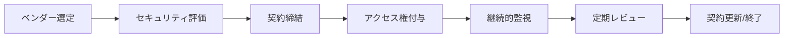
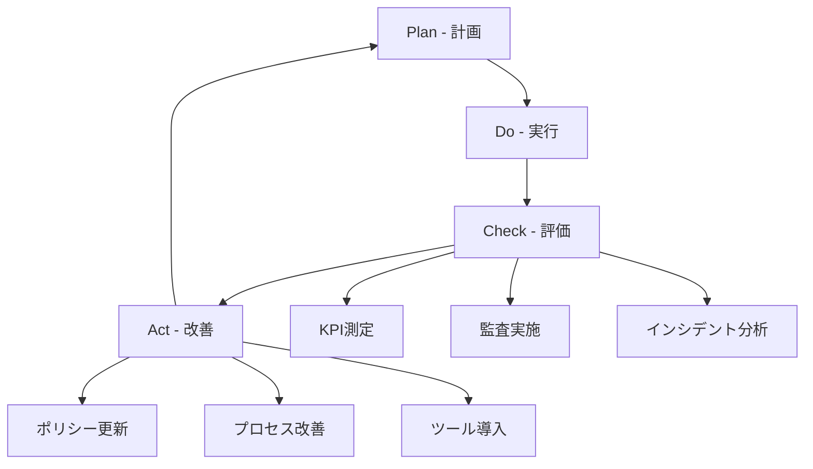

# ガバナンスとコンプライアンスポリシー

## 目次
1. [セキュリティガバナンス体制](#セキュリティガバナンス体制)
2. [コンプライアンス要件](#コンプライアンス要件)
3. [第三者アクセス管理](#第三者アクセス管理)
4. [例外申請プロセス](#例外申請プロセス)
5. [セキュリティトレーニング](#セキュリティトレーニング)
6. [監査と評価](#監査と評価)

## セキュリティガバナンス体制

### 組織構造
```
CEO
 ├── CTO
 │    ├── セキュリティ責任者 (CISO)
 │    │    ├── セキュリティアーキテクト
 │    │    ├── セキュリティエンジニア
 │    │    └── SOCアナリスト
 │    └── 開発責任者
 │         ├── 開発チーム
 │         └── QAチーム
 └── コンプライアンス責任者
      ├── 法務チーム
      └── 監査チーム
```

### 責任分担 (RACI Matrix)
| タスク | セキュリティ責任者 | 開発責任者 | コンプライアンス責任者 | CEO |
|--------|-------------------|-----------|---------------------|-----|
| セキュリティポリシー策定 | A/R | C | C | I |
| インシデント対応 | A/R | I | I | I |
| 脆弱性管理 | A | R | I | I |
| コンプライアンス監査 | C | C | A/R | I |
| リスク評価 | R | C | R | A |

- R: Responsible (実行責任)
- A: Accountable (説明責任)
- C: Consulted (相談)
- I: Informed (報告)

## コンプライアンス要件

### 準拠すべき規制・標準
1. **個人情報保護法（日本）**
   - 個人データの適切な取得・利用・管理
   - 安全管理措置の実施
   - 第三者提供の制限

2. **PCI-DSS** (決済カード情報を扱う場合)
   - レベル4準拠（年間取引件数による）
   - 四半期ごとのネットワークスキャン
   - 年次の自己評価

3. **ISO 27001/27002**
   - 情報セキュリティマネジメントシステム
   - 14の管理領域での統制実施

4. **NIST Cybersecurity Framework**
   - 識別 (Identify)
   - 防御 (Protect)
   - 検知 (Detect)
   - 対応 (Respond)
   - 復旧 (Recover)

### データプライバシー要件
```yaml
個人情報の取扱い:
  収集:
    - 利用目的の明示
    - 同意の取得
    - 必要最小限の情報のみ
  
  保管:
    - 暗号化必須（AES-256）
    - アクセス制御
    - 保持期間の設定
  
  利用:
    - 目的外利用の禁止
    - アクセスログの記録
    - 定期的な棚卸し
  
  削除:
    - 保持期間経過後の確実な削除
    - 削除証跡の保管
    - バックアップからの削除
```

## 第三者アクセス管理

### ベンダー管理プロセス


### ベンダーセキュリティ評価チェックリスト
- [ ] セキュリティ認証の確認（ISO 27001等）
- [ ] セキュリティポリシーの確認
- [ ] インシデント対応体制の確認
- [ ] データ取扱いに関する契約条項
- [ ] 監査権の確保
- [ ] 保険加入状況の確認
- [ ] 過去のセキュリティインシデント履歴
- [ ] 技術的セキュリティ対策の確認

### アクセス権限管理
```typescript
interface VendorAccess {
  vendorId: string;
  vendorName: string;
  contractStart: Date;
  contractEnd: Date;
  accessLevel: 'READ_ONLY' | 'LIMITED_WRITE' | 'FULL_ACCESS';
  allowedResources: string[];
  restrictions: {
    ipWhitelist?: string[];
    timeRestriction?: {
      start: string; // "09:00"
      end: string;   // "18:00"
      timezone: string;
    };
    mfaRequired: boolean;
  };
  approvals: {
    requestedBy: string;
    approvedBy: string;
    approvalDate: Date;
    justification: string;
  };
  reviewSchedule: {
    frequency: 'MONTHLY' | 'QUARTERLY' | 'ANNUALLY';
    lastReview: Date;
    nextReview: Date;
  };
}
```

## 例外申請プロセス

### 例外申請フロー
1. **申請**
   ```yaml
   申請フォーム:
     申請者情報:
       - 氏名
       - 部署
       - 連絡先
     例外内容:
       - 対象ポリシー/ルール
       - 例外の詳細
       - 影響範囲
     理由:
       - ビジネス上の必要性
       - 代替手段の検討結果
     期間:
       - 開始日
       - 終了日
     リスク軽減策:
       - 追加の統制
       - モニタリング方法
   ```

2. **評価**
   - リスク評価の実施
   - 代替案の検討
   - コスト・ベネフィット分析

3. **承認**
   | リスクレベル | 承認者 | SLA |
   |-------------|--------|-----|
   | 低 | セキュリティマネージャー | 2営業日 |
   | 中 | セキュリティ責任者 | 3営業日 |
   | 高 | CTO + セキュリティ責任者 | 5営業日 |
   | 重大 | CEO + CTO + セキュリティ責任者 | 7営業日 |

4. **実装とモニタリング**
   - 承認された例外の実装
   - 追加統制の導入
   - 継続的なモニタリング
   - 定期的なレビュー

### 例外管理記録
```typescript
interface SecurityException {
  exceptionId: string;
  status: 'PENDING' | 'APPROVED' | 'REJECTED' | 'EXPIRED' | 'REVOKED';
  policy: string;
  description: string;
  justification: string;
  riskLevel: 'LOW' | 'MEDIUM' | 'HIGH' | 'CRITICAL';
  requestor: {
    name: string;
    department: string;
    email: string;
  };
  approvals: {
    approver: string;
    date: Date;
    comments?: string;
  }[];
  validity: {
    startDate: Date;
    endDate: Date;
  };
  compensatingControls: string[];
  reviews: {
    date: Date;
    reviewer: string;
    decision: 'CONTINUE' | 'MODIFY' | 'TERMINATE';
    notes: string;
  }[];
}
```

## セキュリティトレーニング

### トレーニングプログラム
1. **新入社員向け（必須）**
   - セキュリティ基礎（2時間）
   - 社内セキュリティポリシー（1時間）
   - インシデント報告手順（30分）
   - 合格テスト（80%以上で合格）

2. **全社員向け（年次）**
   - セキュリティ意識向上（1時間）
   - 最新の脅威動向（30分）
   - フィッシング対策（30分）
   - ソーシャルエンジニアリング対策（30分）

3. **開発者向け（四半期）**
   - セキュアコーディング（3時間）
   - OWASP Top 10対策（2時間）
   - セキュリティテスト手法（2時間）
   - コードレビューのポイント（1時間）

4. **管理者向け（半期）**
   - リスクマネジメント（2時間）
   - インシデント対応指揮（2時間）
   - コンプライアンス管理（1時間）

### フィッシング訓練
```yaml
実施計画:
  頻度: 四半期ごと
  対象: 全社員
  
  シナリオ:
    - 偽の社内通知
    - 偽のパスワードリセット要求
    - 偽の請求書
    - 偽のソフトウェアアップデート
  
  評価指標:
    - クリック率
    - 報告率
    - 個人識別情報の入力率
  
  フォローアップ:
    - クリックした社員への即時教育
    - 全体への結果共有（匿名）
    - 改善トレンドの追跡
```

## 監査と評価

### 内部監査
| 監査項目 | 頻度 | 実施者 | 報告先 |
|---------|------|--------|--------|
| アクセス権限レビュー | 四半期 | セキュリティチーム | CISO |
| セキュリティ設定確認 | 月次 | システム管理者 | セキュリティマネージャー |
| ログレビュー | 週次 | SOCアナリスト | セキュリティマネージャー |
| 脆弱性スキャン | 週次 | セキュリティエンジニア | CISO |
| ペネトレーションテスト | 年次 | 外部業者 | CTO |
| コンプライアンス監査 | 年次 | 監査チーム | CEO |

### KPI（重要業績評価指標）
```yaml
セキュリティKPI:
  脆弱性管理:
    - 平均修正時間（MTTR）
      Critical: < 24時間
      High: < 7日
      Medium: < 30日
      Low: < 90日
    - 未修正脆弱性数: < 10件
  
  インシデント対応:
    - 平均検知時間（MTTD）: < 1時間
    - 平均対応時間（MTTR）: < 4時間
    - インシデント再発率: < 5%
  
  アクセス管理:
    - 不正アクセス試行検知率: > 95%
    - 特権アカウント使用率: < 10%
    - MFA採用率: 100%
  
  トレーニング:
    - 受講率: > 95%
    - 合格率: > 90%
    - フィッシング訓練失敗率: < 5%
  
  コンプライアンス:
    - 監査指摘事項数: < 5件
    - 指摘事項改善率: 100%
    - ポリシー違反件数: < 3件/月
```

### 継続的改善プロセス


### レポーティング
1. **経営層向けダッシュボード（月次）**
   - セキュリティスコアカード
   - 主要インシデントサマリー
   - コンプライアンス状況
   - リスクヒートマップ

2. **詳細レポート（四半期）**
   - 脆弱性管理状況
   - インシデント詳細分析
   - 監査結果と改善計画
   - 投資対効果分析

3. **年次セキュリティレビュー**
   - 年間セキュリティ投資と成果
   - 次年度セキュリティ戦略
   - 長期ロードマップ

---

本ポリシーは年次でレビューし、必要に応じて更新します。
最終更新日: 2024-01-01
次回レビュー予定: 2025-01-01